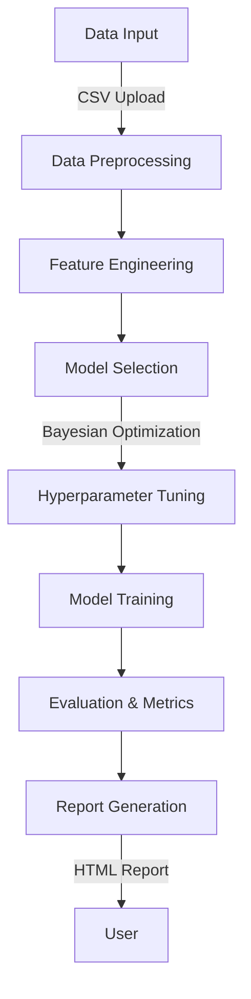

# Automatica: A Comprehensive End-To-End Automated Deep Learning System
Automatica is a robust, modular automated deep learning system designed to simplify preprocessing, feature engineering, model selection, hyperparameter tuning, and training for deep learning tasks. The Automatica_Notebook_Final.ipynb serves as an implementation that combines interactive data analysis, preprocessing, and advanced model training techniques into an integrated workflow presented on a clean Gradio interface.

## System Architecture

The system is designed to integrate every stage of the machine learning pipeline seamlessly:


## Features

- **Interactive Feature Selection**: Use mutual information to determine the most relevant features.
- **Modular Model Architectures**: Includes `ResNetMLP`, `DenseNetTabular`, `TransformerTabular`, and `TabNetModel`.
- **Hyperparameter Optimization**: Implements Bayesian search for optimal hyperparameters.
- **Comprehensive Visualizations**: Provides detailed plots for feature relationships, training curves, and metric comparisons.
- **Efficient Training**: Supports GPU acceleration and includes early stopping mechanisms.
- **Report Generation**: Creates detailed HTML reports summarizing data processing, model selection, and performance.

## Installation and Usage

Follow these steps to set up and run the `Automatica_Notebook_Final.ipynb` notebook to use the Automatica application and access the Gradio interface:

### 1. Clone the Repository

First, clone the repository to your local machine:

```bash
git clone https://github.com/kentaterasaki/Automatica.git
cd Automatica/Automatica_Notebook
```

---

### 2. Install Dependencies

Ensure you have Python 3.9+ installed. Use the `requirements.txt` file provided in the same folder to install all necessary dependencies:

```bash
pip install -r requirements.txt
```

This will install all libraries required to run the notebook, including Gradio, PyTorch, scikit-learn, and others.

---

### 3. Open and Run the Notebook

Launch Jupyter Notebook or VSCode and open the `Automatica_Notebook_Final.ipynb` file:

```bash
jupyter notebook Automatica_Notebook_Final.ipynb
```

Once the notebook interface opens:

**Execute All Cells**:
   - Ensure all the cells in the notebook are run sequentially.
   - At the bottom of the notebook, the Gradio interface is generated.

---

### 4. Access the Gradio Interface

After running the notebook, a link to the Gradio interface will appear in the last cell's output. It will look something like this:

```
Running on local URL:  http://127.0.0.1:7860/
```

1. **Click on the Link**:
   - Open the link in your web browser.
   - The Gradio interface allows you to interact with the Automatica application for data preprocessing, feature engineering, and model selection.

2. **Upload Your Dataset**:
   - Use the interface to upload your dataset and start building models interactively.

---

### 5. Stop the Notebook

Once you are done using the Gradio interface:

- **Close the Browser Tab** for the Gradio link.
- **Stop the Notebook** by selecting "Kernel > Shutdown" in the Jupyter Notebook menu.

---

## Technical Details

### Dependencies

The system relies on the following major libraries:
- **Gradio**: For interactive visualizations and UI.
- **PyGWalker**: For interactive exploratory data analysis and visualization.
- **PyTorch**: For building and training deep learning models.
- **Scikit-learn**: For feature engineering, preprocessing, and evaluation.
- **Scikit-optimize**: For automated hyperparameter optimization.
- **Plotly**: For interactive visualizations.

### Model Architectures

| Model                | Description                                  |
|----------------------|----------------------------------------------|
| **ResNetMLP**        | Deep residual MLP for tabular data.          |
| **DenseNetTabular**  | DenseNet-inspired architecture for features. |
| **TransformerTabular** | Transformer-based model for tabular data.   |
| **TabNetModel**      | TabNet implementation with self-attention.   |

---

## License

This project is licensed under the MIT License.
