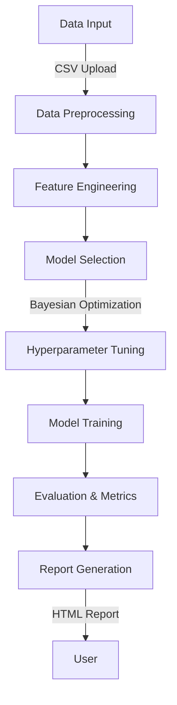

```mermaid
graph TD
    A[Data Input] -->|CSV Upload| B[Data Preprocessing]
    B --> C[Feature Engineering]
    C --> D[Model Selection]
    D -->|Bayesian Optimization| E[Hyperparameter Tuning]
    E --> F[Model Training]
    F --> G[Evaluation & Metrics]
    G --> H[Report Generation]
    H -->|HTML Report| I[User]
```
